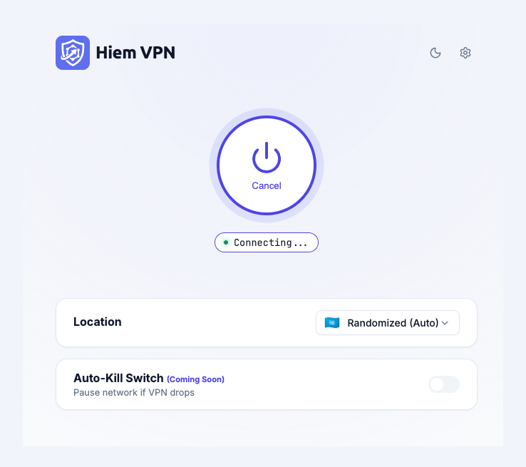
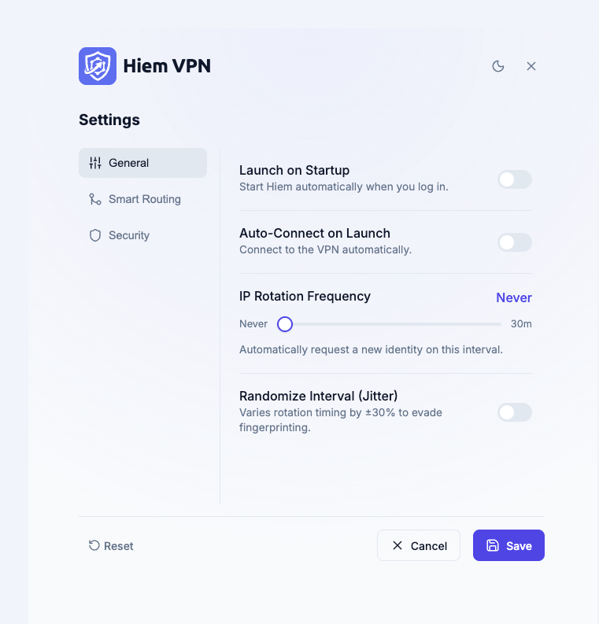

# Hiem VPN 

<p align="center">
  
  &nbsp; &nbsp;
  
</p>

A beautiful, native desktop VPN application built for macOS. Hiem VPN uses the Tor network and Privoxy under the hood to provide secure, encrypted, and globally-routed proxy connections directly integrated with macOS system networking.

## Architecture
- **Frontend**: A lightning-fast native macOS desktop application built with Tauri, HTML, CSS, and Vanilla JS.
- **Backend**: A headless Python Sidecar built with FastAPI, functioning as the core State Machine and Engine Spawner.
- **Engines**: Tor (for encrypted routing) and Privoxy (for smart split-tunneling and routing rules).

## 🚀 Mac App Installation & Build Guide

### Prerequisites
1. **Homebrew** installed (`brew --version`)
2. **Node.js** & **npm** installed (`node --version`)
3. **Python 3.11+** installed
4. **Rust** installed (required for Tauri: `curl --proto '=https' --tlsv1.2 -sSf https://sh.rustup.rs | sh`)

### Step 1: Install System Dependencies
Hiem VPN relies on Tor and Privoxy binaries. Install them globally via Homebrew:
```bash
brew install tor privoxy
```

### Step 2: Build the Python Backend (Sidecar)
The Tauri app requires the Python backend to be compiled into a standalone executable (Sidecar). We use PyInstaller for this.

```bash
# 1. Create and activate a Python virtual environment
python3 -m venv venv
source venv/bin/activate

# 2. Install backend dependencies
pip install -r requirements.txt

# 3. Compile the backend using PyInstaller
cd webapp
pyinstaller main.spec
```

Once compiled, copy the resulting executable into the Tauri binaries folder:
```bash
cp build/main/main ../tauri-app/src-tauri/bin/python-backend-aarch64-apple-darwin
```
*(Note: If you are on an Intel Mac, rename the target binary to `python-backend-x86_64-apple-darwin`)*

### Step 3: Build the Tauri Mac App
Now that the backend is bundled as a Sidecar, you can compile the native macOS application.

```bash
# Navigate to the Tauri app folder
cd ../tauri-app

# Install frontend dependencies
npm install

# Build the final macOS application (.app and .dmg)
npm run tauri build
```

Once the build finishes, your final application will be located at:
`tauri-app/src-tauri/target/release/bundle/macos/Hiem VPN.app`

You can drag and drop `Hiem VPN.app` into your Applications folder!

## Development & Local Testing
If you want to edit the UI or Python logic without waiting for a full Tauri build loop:

1. **Start the Python Backend**:
   ```bash
   source venv/bin/activate
   cd webapp
   uvicorn main:app --host 127.0.0.1 --port 8080 --reload
   ```

2. **Serve the Frontend**:
   ```bash
   cd webapp/static
   python3 -m http.server 8000
   ```
3. Open `http://localhost:8000` in your browser. The frontend will automatically detect it is running in a browser and use a dev token to talk to your backend on port 8080.
